# 도란도란

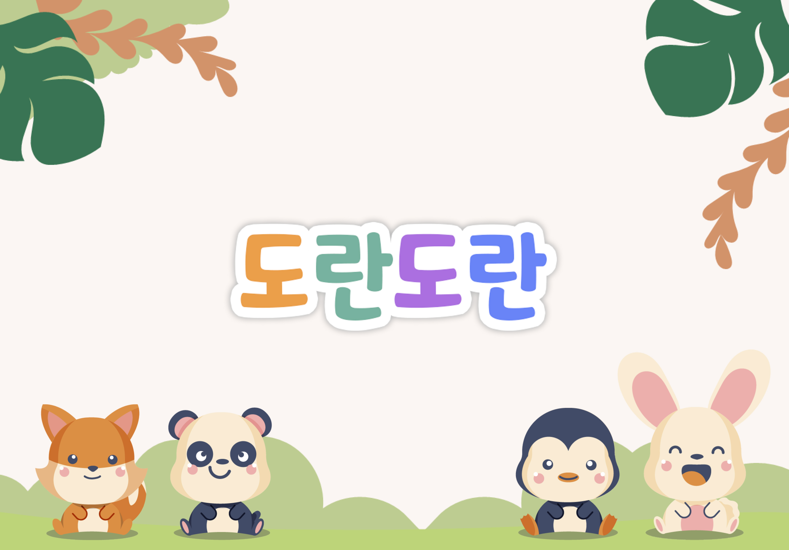

### **🏆삼성 청년 SW아카데미(SSAFY) 9th 자율프로젝트 우수상🏆**

> **2023.10.10 ~ 2023.11.17**
>

## ✅ 멤버소개

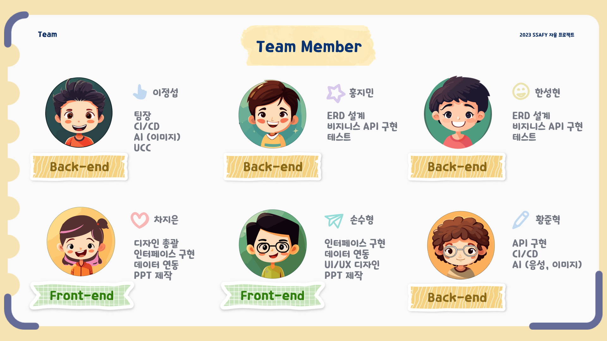

## ✅ 기술스택
<table>
    <tr>
        <td><b>Back-end</b></td>
        <td>

 

 

</td>
    </tr>
    <tr>
    <td><b>Front-end</b></td>
    <td>

    </td>
    </tr>
    <tr>
    <td><b>Infra</b></td>
    <td>

</td>
    <tr>
    <td><b>Tools</b></td>
    <td>
    
    

    </td>
    </tr>
</table>

## ✅ 아키텍쳐

## ✅ 프로젝트 소개

**🚩 서비스 한줄 소개**

부모의 목소리로 읽어주는 동화낭독 서비스 “**도란도란**”

▪️**기획의도 및 배경**

[문제제기]

맞벌이 가정의 증가로 아이가 혼자 있는 시간이 많아짐

 → 부모와의 물리적, **심리적 거리가 멀어지고** 외벌이 가족과 비교했을 때 상대적으로 **정서적 스트레스, 불안감**을 느끼는 아이가 많아짐.

[문제제기 2]

결제 때 마다 미리 할인 혜택을 알아보는 것이 귀찮기도 하고, 결제 직전에 ‘잠깐만요!’를 외치며 주섬주섬 적합한 카드를 찾는게 민망한 상황이 연출 되기도 함

[솔루션 도출]

부모의 목소리를 AI를 통해 동화를 낭독하여, 아이의 정서적 안정감을 채워주자

▪️**서비스 목적**

- AI를 활용한 부모의 목소리를 통해 부모와 아이의 심리적 거리를 좁혀주고 아이에게 심리적 안정감을 제공하는 것.

▪️**서비스 목표**

- 부모의 목소리를 녹음하여 가상의 목소리 생성
- 위에서 생성된 목소리를 활용한 동화 낭독
- 그 외, 부모 아이간 유대감을 형성할 수 있는 컨텐츠 제작 (편지, 앨범 등)

▪️**기대효과**

- 부모 아이간 물리적으로 거리가 멀어도, 동화를 직접 읽어주었을때의 긍정적 효과를 얻을 수 있음
- 부모 아이간 정서적 안정감, 유대감 형성
- 아이가 책에 대한 친밀감 형성

## ✅ 기능 소개

### 스플래시
<table>    
    <tr align="center" > 
        <td><strong>스플래시</strong></td>
    </tr>
    <tr align="center"> 
        <td> 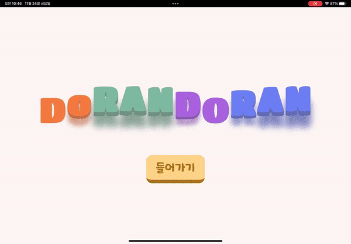 </td>
    </tr>
    <tr> 
        <td>
            1. 아이 친화적인 UI 
            2. 애니메이션과 배경음을 사용하여 흥미를 유도
        </td>
</table>

### 회원가입, 로그인

<table>    
    <tr align="center" > 
        <td><strong>아이 로그인</strong></td>
        <td><strong>부모 로그인</strong></td>
    </tr>
    <tr align="center"> 
        <td>  </td>
        <td>  </td>
    </tr>
    <tr> 
        <td>
            1. 초대 코드를 이용한 로그인 
            2. 계정에 등록되어 있는 멀티 프로필 선택 가능
        </td>
        <td>
            1. 소셜 로그인을 사용한 로그인  
        </td>
</table>

### 메인 화면

<table>    
    <tr align="center" > 
        <td><strong>아이 메인</strong></td>
        <td><strong>부모 메인</strong></td>
    </tr>
    <tr align="center"> 
        <td> 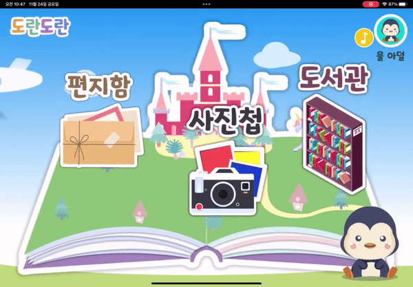 </td>
        <td> 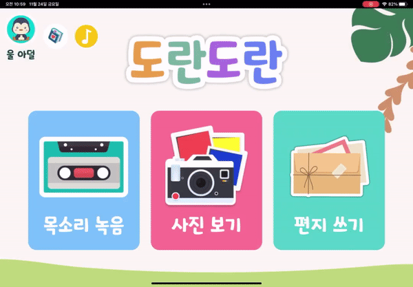 </td>
    </tr>
    <tr> 
        <td>
            1. 아이를 위한 직관적이고 귀여운 UI 
        </td>
        <td>
            1. 해당 월에 할인, 소비한 금액을 확인 가능 
            2. 하단 바코드를 통해 오프라인 결제 가능
        </td>
</table>

## 아이 기능

### 동화 낭독

<table>    
    <tr align="center" > 
        <td><strong>동화 낭독</strong></td>
        <td><strong>동화 낭독</strong></td>
    </tr>
    <tr align="center"> 
        <td>  </td>
        <td>  </td>
    </tr>
    <tr> 
        <td>
            1. 스크립와 부모님 목소리를 사용하여 동화 낭독  
            2. 스크립트에 맞는 그림을 사용하여 가독성 향상  
            3. 사이드의 화살표를 이용하여 이전, 다음 이동
        </td>
        <td>
            1. 스크립와 부모님 목소리를 사용하여 동화 낭독  
            2. 스크립트에 맞는 그림을 사용하여 가독성 향상  
            3. 사이드의 화살표를 이용하여 이전, 다음 이동
        </td>
</table>

### 도서관 기능
<table>    
    <tr align="center" > 
        <td><strong>동화 리스트</strong></td>
        <td><strong>좋아요</strong></td>
    </tr>
    <tr align="center"> 
        <td>  </td>
        <td> 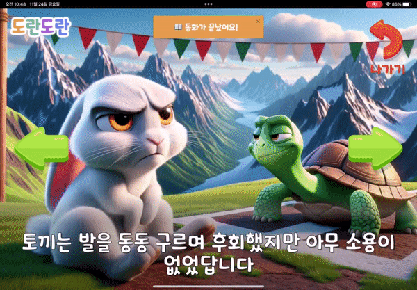 </td>
    </tr>
    <tr> 
        <td>
            1. 동화책 리스트 확인 
            2. 녹음되지 않은 동화는 자물쇠를 이용한 잠금  
            3. 엄마, 아빠를 선택하여 동화 낭독 목소리 선택
        </td>
        <td>
            1. 동화가 끝난 이 후 후기 등록  
            2. 아이가 좋아하는 동화는 부모 계정에서 확인 가능
        </td>
</table>

### 아이 친화 기능
<table>    
    <tr align="center" > 
        <td><strong>동물 고르기</strong></td>
        <td><strong>튜토리얼</strong></td>
    </tr>
    <tr align="center"> 
        <td>  </td>
        <td>  </td>
    </tr>
    <tr> 
        <td>
            1. 캐릭터 선택 시 메인 화면의 안내 동물 변경  
            2. 동물마다 선택 시 안내 음성을 통한 재미 요소 추가  
            3. 귀여운 캐릭터를 이용한 친밀감 형성
        </td>
        <td>
            1. 하단의 동물 클릭 시 튜토리얼 기능 활성화 
            2. 각 기능 클릭 시 동물의 음성으로 튜토리얼 안내 진행 
            3. 동물 재 클릭 시 튜토리얼 기능 off
        </td>
</table>

## 부모 기능

### 음성 녹음 주의사항 및 중간저장
<table>    
    <tr align="center" > 
        <td><strong>주의사항</strong></td>
        <td><strong>중간저장</strong></td>
    </tr>
    <tr align="center"> 
        <td> 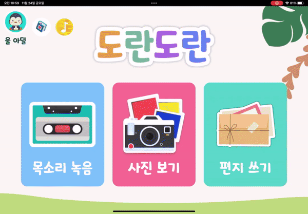 </td>
        <td> 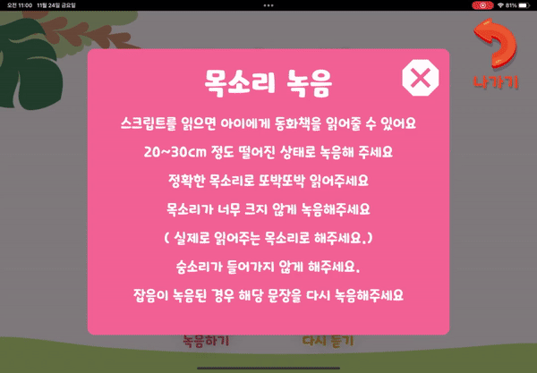 </td>
    </tr>
    <tr> 
        <td>
            1. 사용자의 성별 선택 
            2. 좋은 결과물을 뽑아내기 위한 주의 사항 안내
        </td>
        <td>
            1. 녹음 된 기록이 있는 경우 이어하기 가능 
            2. 처음부터 진행 가능 
            3. 녹음 된 기록이 없는 경우 처음부터 진행
        </td>
</table>

### 음성 녹음
<table>    
    <tr align="center" > 
        <td><strong>녹음 및 다시 듣기</strong></td>
        <td><strong>녹음 완료</strong></td>
    </tr>
    <tr align="center"> 
        <td> 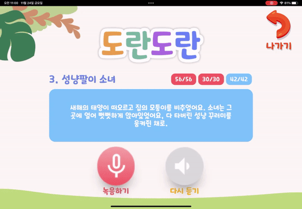 </td>
        <td> 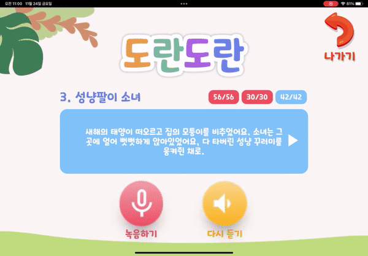 </td>
    </tr>
    <tr> 
        <td>
            1. 녹음하기 버튼을 눌러 음성 녹음 가능 
            2. 다시듣기 버튼을 눌러 녹음본 다시 듣기 가능 
            3. 녹음 진행 시 다음 스크립트 버튼 활성화
        </td>
        <td>
            1. SMS를 통해 AI 학습 대기열 안내 
            2. 예상 대기 시간 안내 
            3. AI 학습 완료 시 안내 문자 전송
        </td>
</table>

### 공통 기능 (편지, 사진첩)
<table>    
    <tr align="center" > 
        <td><strong>그림 편지 쓰기</strong></td>
        <td><strong>그림 편지 받기</strong></td>
        <td><strong>사진첩</strong></td>
    </tr>
    <tr align="center">
        <td> 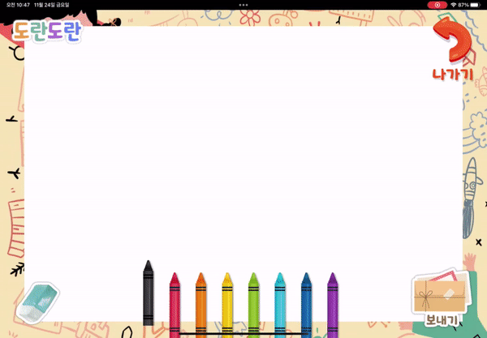 </td>
        <td> 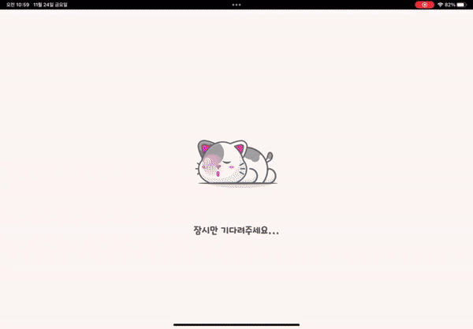 </td>
        <td>  </td>
    </tr>
    <tr> 
        <td>
            1. 색연필을 사용하여 그림편지 작성  
            2. 보내기 버튼을 통해 부모님, 아이에게 편지 전송
        </td>
        <td>
            1. 로그인 진행 시 편지 수신 
            2. 클릭하여 편지 확인
        </td>
        <td>
            1. 부모와 아이는 같은 앨범을 공유 
            2. 우측에서 디테일한 확인 가능  
            3. 그림 편지 수신 시 사진첩에 자동 등록
        </td>
</table>

## ✅ 활용기술, 기술 설명

아이에게 익숙한 커스텀 UI / UX

RVC를 활용한 가상의 목소리 생성

RabbitMq를 활용한 트래픽 완화

    

    **개요**

    1. 녹음된 목소리를 활용하여 모델을 생성해야하는데 평균적으로 1시간 ~ 3시간 정도 소요됨.
    2. 위의 과정을 스프링 <-> RVC Python Server 기존 아키텍처에서 수행했을 때 하나의 요청, 응답이 3시간 정도 소요됨.
        - **응답이 처리되는동안 요청을 보낸 유저는 다른 작업을 수행 할 수 없으며**,
        - "또한 파이썬 서버에서 **모델 학습, 추론이 별개로 일어날 수 있도록 "병렬 처리"**가 필요했음."
            - 모델학습과 추론의 분산 -> GPU 효율 개선

    **해결**

    1. 기존 아키텍처 사이에 메세지 브로커인 RabbitMq를 적용 ( Spring Server <-> Rabbit Mq <-> Python Server )
        - 요청 API에서 처리되어야 할 **모델 학습, 추론이 다른 API에게 위임**
        - 프로세스를 분산시킴으로써 **효율이 올라가고, 체감 속도 개선**

## ✅ 산출물
<table>    
    <tr align="center" > 
        <td><strong>개발 목업</strong></td>
        <td><strong>API 명세서</strong></td>
    </tr>
    <tr align="center">
        <td> </td>
        <td> </td>
    </tr>
</table>
<table>
    <tr align="center" > 
            <td><strong>ERD</strong></td>
        </tr>
    <tr align="center">
            <td> 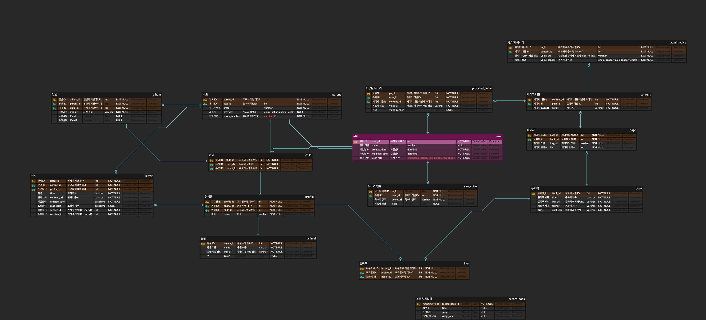 </td>
        </tr>
</table>
 
<table>
    <tr align="center" > 
        <th>4주차 번다운차트</th>
        <th>3주차 번다운차트</th>
        <th>2주차 번다운차트</th>
        <th>1주차 번다운차트</th>
    </tr>
    <tr align="center">
        <td>  </td>
        <td></td>
        <td></td>
        <td>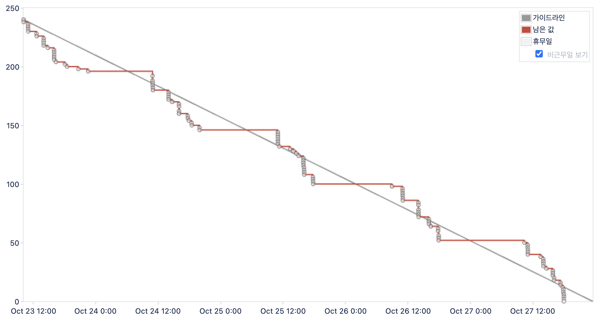</td>
    </tr>
</table>

## ✅ 파일구조

front

back

ai

## ✅ 최종발표 ppt
[발표 자료 링크](assets/발표자료/도란도란%20발표자료.pdf)

